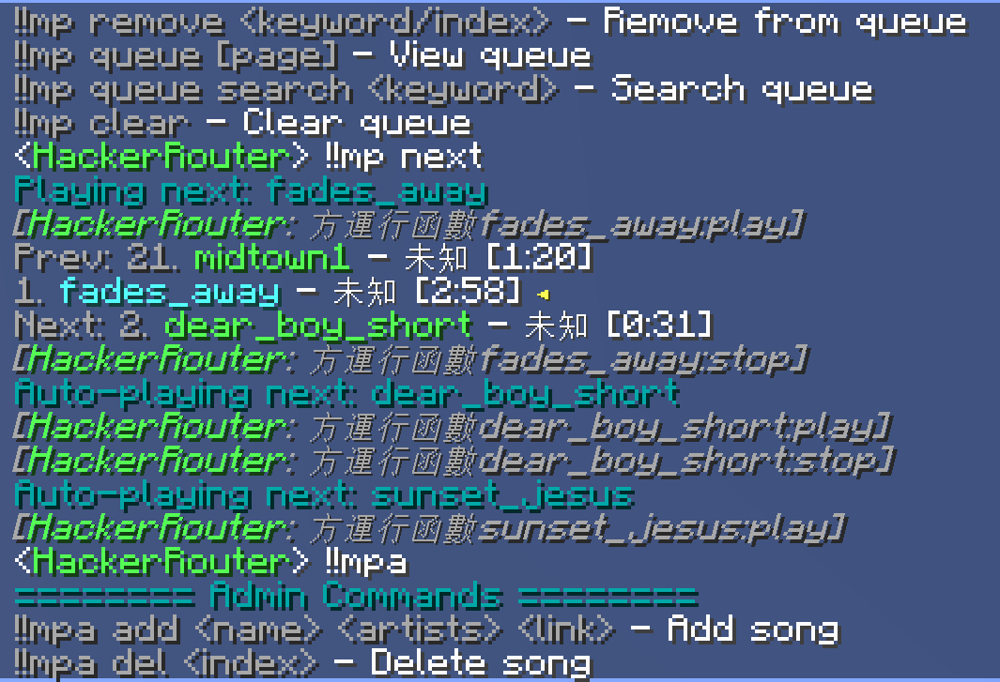

[English](README.md) | 简体中文

# MidiPlayer

一个 [MCDReforged](https://github.com/Fallen-Breath/MCDReforged) 插件，用于在 Minecraft 服务器中播放由 [Note Block Studio](https://github.com/OpenNBS/NoteBlockStudio) 转换 MIDI 文件/`.nbs`文件 得到的数据包音乐。

同时提供 GUI 和 CLI 工具，用于生成 `songs.json` 配置文件。



---

## 使用流程

1. 准备好音乐文件 (`.mid`, `.nbs` 或者其他可以导入 [Note Block Studio](https://github.com/OpenNBS/NoteBlockStudio) 的文件)

2. 用 [Note Block Studio](https://github.com/OpenNBS/NoteBlockStudio) 导出为数据包。
（是的，你想给数据包的导出参数改成什么都可以）

- 在 [NBS 官网](https://noteblock.studio/) 下载并安装 Note Block Studio

- 左上角选择 `打开歌曲` (适用于 `.nbs` 文件) / `从 MIDI 文件导入`

- 打开后，左上角选择 `导出为数据包`

- 选择正确的 `Minecraft 版本`，选择 `导出`

3. 使用 [GUI 工具](#gui-工具) 或者 [CLI 工具](#cli-工具)导出 `songs.json`

4. 将 `songs.json` 放置在 `./config/midiplayer` 下

5. 安装 midiplayer 插件。如将 `midiplayer.pyz` 拖入 `./plugins` 下

6. 启动 [MCDReforged](https://github.com/Fallen-Breath/MCDReforged)，加载插件

---

## 游戏内插件用途

### 玩家命令 `!!mp`

| 命令 | 说明 |
|------|------|
| `!!mp` | 显示帮助 |
| `!!mp list [页码]` | 歌曲列表 |
| `!!mp links [页码]` | 链接列表 |
| `!!mp search <关键词>` | 搜索歌曲 |
| `!!mp play [关键词/序号]` | 播放歌曲 |
| `!!mp pause` | 暂停 |
| `!!mp resume` | 继续播放 |
| `!!mp now` | 查看正在播放 |
| `!!mp next` | 下一首 |
| `!!mp prev` | 上一首 |
| `!!mp mode <模式>` | 播放模式（single/random/sequential/loop） |
| `!!mp shuffle` | 随机打乱队列 |
| `!!mp add <关键词/序号>` | 加入队列 |
| `!!mp remove <关键词/序号>` | 移出队列 |
| `!!mp queue [页码]` | 查看队列 |
| `!!mp queue search <关键词>` | 搜索队列 |
| `!!mp clear` | 清空队列 |

### 管理命令 `!!mpa`

| 命令 | 说明 |
|------|------|
| `!!mpa add <歌名> <艺术家> <链接>` | 添加歌曲 |
| `!!mpa del <序号>` | 删除歌曲 |
| `!!mpa copy <序号>` | 复制歌曲 |
| `!!mpa set <序号> name <歌名>` | 编辑歌名 |
| `!!mpa set <序号> artist <艺术家>` | 编辑艺术家 |
| `!!mpa set <序号> link <链接>` | 编辑链接 |
| `!!mpa set <序号> duration <秒数>` | 编辑时长 |
| `!!mpa info [页码]` | 歌曲详情列表 |
| `!!mpa debug [玩家名]` | 调试信息 |
| `!!mpa timer <玩家名> reset` | 重置计时器 |
| `!!mpa timer <玩家名> interval <秒>` | 修改计时器间隔 |
| `!!mpa timer <玩家名> active <true/false>` | 开关计时器 |

---

## GUI 工具

GUI 提供可视化界面来生成 `songs.json` 文件。

### 启动方式

若 `.pyz` 文件已被成功关联，则可双击直接启动 GUI。

或者使用如下命令：
```bash
python midiplayer.pyz --gui
```

### 使用说明

1. 左侧输入框：每行输入 `歌名 - 艺术家1, 艺术家2, ...`
2. 中间输入框：对应的数据包 ID（逐行对应左侧歌曲）
3. 右侧预览框：自动生成的 JSON 预览

- 点击「导入数据包」可直接导入 `.zip` 数据包文件，自动解析调用名称（这里被称为link）和时长
- 点击「导出JSON」保存为 `songs.json`
- 点击「导入JSON」可加载已有的 `songs.json` 进行编辑

---

## CLI 工具

命令行模式用于批量生成 `songs.json`。

### 用法

```bash
python midiplayer.pyz <歌曲-艺术家文本文件> <数据包ID文本文件/数据包目录> [输出路径]
```

### 参数说明

| 参数 | 说明 |
|------|------|
| `歌曲-艺术家文本文件` | 每行格式为 `歌名 - 艺术家` 的文本文件 |
| `数据包ID文本文件/数据包目录` | 每行一个数据包 ID 的文本文件，或包含 `.zip` 数据包的目录 |
| `输出路径`（可选） | JSON 输出目录，默认为当前目录 |

### 示例

```bash
# 使用文本文件
python midiplayer.pyz songs.txt datapacks.txt ./output

# 使用数据包目录（自动从 zip 解析链接和时长）
python midiplayer.pyz songs.txt ./datapacks/ ./output
```

---

## 打包

打包为 `.pyz`（Python Zip Application），既可独立运行为 CLI/GUI 工具，又可作为 MCDR 插件使用。

在项目根目录（`midiplugin` 的上级目录）执行：

```bash
python -m zipapp midiplugin -o midiplayer.pyz
```

---

## 依赖

- Python >= 3.8
- [MCDReforged](https://github.com/Fallen-Breath/MCDReforged) >= 2.0.0-alpha.1（仅游戏内插件需要）
